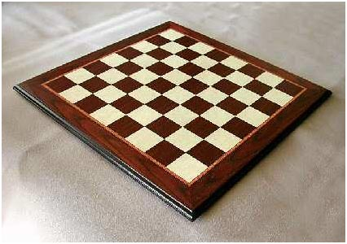

# Projective Geometry and Homography
---
Chenhao Yang 2022.09.29

## Affine Rectification
Affine rectification is to generate affinely correct warps for images that are captured through perspective cameras (assume pinhole camera model), with annotations of at least 2 pairs of parallel lines.

### Usage
```
python main.py --mode affine_rectification
```
The program loads pre-specified images and pre-annotated points and computes their corresponding homography transformation matrix upto affine correct rectification, the results will be saved into `Affine_Rectified`.
### Results

| Input Image | Annotated parallel lines on input image | Affine-Rectified Image |
| ----------- | ----------- | ----------- |
|   |  |    |
|    |  |    |
|    |  |    |
|    |  |    |
|    |  |    |

### Evaluation
Evaluate Angles (more precisely, the cosines) of at least another 2 pairs of parallel lines before and after rectification. This will show how far from 1 the cosines are in the original image and how close to correct the final affine rectification is.

|Test 1 | Pair 1 | Pair 2|
| --- | --- | --- |
|Before:| 0.9566|  0.9999|
|After:| 1.0000 | 1.0000|
|Test 2|Pair 1 | Pair 2|
| Before:| 0.9815|  0.9514|
|After:| 1.0000  |1.0000|
|Test 3|Pair 1 | Pair 2|
|Before:| 0.9831 | 0.9628|
|After: |1.0000 | 1.0000|
|Test 4|Pair 1 | Pair 2|
|Before:| 0.8678|  0.9892|
|After:| 1.0000 | 1.0000|
|Test 5|Pair 1 | Pair 2|
|Before:| 0.8777|  0.9999|
|After:| 1.0000 | 1.0000|

### Implementation details

**Affine rectification via Vanishing Line**

1. Find at least pairs of parallel lines in perspective image plane
2. Using the parallel lines to identify vanishing points
3. Using the vanishing points to compute vanishing line $l_{\infty}'$
4. Compute $H$, such that $l_{\infty} = H^{-T}l_{\infty}'$, we can compute $H^{-T}$ in the form of:
    $$
    H^{-T} = \begin{bmatrix}
        1 & 0 & -a/c \\
        0 & 1 & -b/c \\
        0 & 0 & 1/c
            \end{bmatrix}
    $$
    and then compute the corresponding $H$ and get the rectified images

## Metric Rectification
 Metric Rectification is to generate metrically correct warps for images that are captured through perspective cameras (assume pinhole camera model), with annotations of at least 2 pairs of perpendicular lines, based on results from affine rectification.

 ### Usage 
 ```
 python main.py --mode metric_rectification
 ```
 The program loads predefined images and annotations, corresponding results will be saved under `Metric_Rectified`.

### Results

| Input Image | Annotated parallel lines on input image | Affine-Rectified Image |
| ----------- | ----------- | ----------- |
|   |  |    |
|    |  |    |
|    |  |    |
|    |  |    |
|    |  |    |


**Dataset Preparation**
 1. Find (or capture) `2` images. Ideally capture images that have sufficient perspective.
 2. Run your code on at least `3` images provided in the `data/q1` folder as well as *on the images you captured* (`5` images in total).

**Submission**
1. Input Images
2. Output Images: Rectified images and intermediate images with color coded annotation that you used. See the following figures:

    | Input Image | Annotated perpendicular lines on input image | Annotated perpendicular lines on Affine-Rectified Image | Rectified Image |
    | ----------- | ----------- | ----------- | --------- |
    |     |    |  |  |

### Evaluation
Evaluate Angles (more precisely, the cosines) of at least another 2 pairs of parallel lines before and after rectification. This will show how far from 1 the cosines are in the original image and how close to correct the final affine rectification is.

|Test 1 | Pair 1 | Pair 2|
| --- | --- | --- |
|Before:| -0.6164 | -0.6018|
|After: |-0.0000 | 0.0000|
|Test 2|Pair 1 | Pair 2|
|Before: |0.8928 | -0.8043|
|After: |0.0000 | 0.0000|
|Test 3|Pair 1 | Pair 2|
|Before: |0.7238 | -0.5650|
|After: |0.0000 | 0.0000|
|Test 4|Pair 1 | Pair 2|
|Before: |-0.2207 | -0.0779|
|After: |-0.0000 | 0.0000|
|Test 5|Pair 1 | Pair 2|
Before: |0.2448 | 0.3842|
|After: |0.0000 | 0.0000|

### Implementation details
**Metric rectification using $C_{\infty}^*$**
The dual conic $C_{\infty}^*$ neatly packages all the information required for a metric rectification. It enables both the projective and affine components of a projective transformation to be determined, leaving only similarity distortions. 

A suitable rectifying homography may be obtained directly from the identified $C_{\infty}^{*'}$ in an image using the SVD.

Suppose an image has been affinely rectified, then we require two constraints to specify the 2 degrees of freedom of the circular points in order to determine a metric rectification. These two constraints may be obtained from two imaged right angles on the world plane. Suppose the lines l′,m′ in the affinely rectified image correspond to an orthogonal line pair l, m on the world plane. $l'C_{\infty}^{*'}m' = 0$
1. Find at least two pairs of perpendicular lines
2. Solve 
    $$C_{\infty}^{*'} = \begin{bmatrix}
    KK^T & \textbf{0}\\
    \textbf{0}^T & 0
    \end{bmatrix}
    $$
3. Compute SVD of $C_{\infty}^{*'}$, and find H:
    $$
    H = \begin{bmatrix}    
    \sqrt{\sigma_1^{-1}} & 0 & 0 \\
    0 & \sqrt{\sigma_2^{-1}} & 0 \\
    0 & 0 & 1
    \end{bmatrix} U^T
    $$
4. Apply homography transformation.

## Planar Homography from Point Correspondences
Estimate homographies between two images using point correspondences.

### Usage
```bash
python main.py --mode point-correspondence
```

### Results
| Normal Image | Perspective Image | Annotated corners in Perspective Image | Warped and Overlaid Image |
| ----------- | ----------- | ----------- | ----------- |
|    |   |    |  |

### Implementation Details
Each point correspondence generates two equations for the elements of H, which after multiplying out are:
$$
x'(h_{31}x + h_{32}y+h_{33}) = h_{11}x+h_{12}y+h_{13}\\
y'(h_{31}x + h_{32}y+h_{33}) = h_{21}x+h_{22}y+h_{23}
$$
We can use four pairs of correspondences to compute the full plannar homography transformation matrix.
1. Find at least four pairs of point correspondences from between the source image (normal image) and the target image (perspective image).
2. Write equation in form of $Ah = b$ and use SVD to solve $h$, where $h$ is $[h_{11}, h_{12}, h_{13},h_{21}, h_{22}, h_{23},h_{31}, h_{32}, h_{33},]^T$
3. Reshape to get H and apply homography transformation on the target image.


## Direct Metric Rectification
Previously, we generated metrically correct warps of images with annotations of 2 pairs of perpendicular lines based on the result from affinely correct result . In this section, the goal is to metric-rectify the image directly from **at least 5 pairs** of perpendicular lines. Note you can use more than 5 pairs to get more accurate results.

### Usage
```
python main.py --mode direct_metric_rectification
```
The program computes metric rectification using 7 pre-selected perpendicular line pairs.
### Result
| Input Image | Annotated perpendicular lines | Rectified Image |
| ----------- | ----------- | ----------- |
|     |    |   |

## Evaluation 
The testing was performmed on one only sample because of the cumbersome mannual annotation work, the costine value of angles between 3 pairs of perpendicular lines before and after warpping are as follows:
|Before | After|
|---| ---|
|-0.1551|0.0020|
|  0.0451 |0.0157|
| 0.0543|-0..0094|

### Implementation Details
Suppose lines l and m are images of orthogonal lines on the world plane; then from result $l^TC_{\infty}^*m = 0$, and in a similar manner to constraining a conic to contain a point, this provides a linear constraint on the elements of $C_{\infty}^*$, namely
$$
(l_1m_1, (l_1m_2 + l_2m_1)/2, l_2m_2, (l_1m_3 + l_3m_1)/2, (l_2m_3 + l_3m_2)/2, l_3m_3) \textbf{c} = 0
$$
where $\textbf{c} = (a, b, c, d, e, f )^T$ is the conic matrix of $C_{\infty}^*$ written as a 6-vector.
1. Find at least 5 pairs of perpendicular lines in the image, in practicem exactly 5 pairs may not be sufficient, here I used 7 pairs
2. Formulate the above equation and compute $C_{\infty}^*$ using SVD
3. Use similar method to get H as previous section.
4. Apply warpping transformation to the original image.

---
## Dummy VR Application
Using Planar Homography from Point Correspondences, we can do something fun!

|Source Image 1|Source Image 2 |Source Image 3|
| ----------- | ----------- | ----------- |
|  | | |


| Perspective Image |
| ----------- |
||


| Warpped Image |
| ----------- |
||

### Implementation Details:
The key of implementation is recursively apply warp perspective on target image using different homography transformation matrix and source images.