# HW2: Single-view Reconstruction
## Updates
* 10/03: Reference annotations released for q2a, q2b & q3. 

  Explanation of format and example code for visualization can be found in [annotations.py](https://github.com/geometric3d/assignment2/blob/master/annotations.py). It's not mandatory to use the reference annotations; you may use your annotations instead.

## Instructions
* Late Submission Policy: See the late submission policy [here](https://geometric3d.github.io/pages/assignments/hw0.html).
* Submitting your work: Check the instructions for submission [here](https://geometric3d.github.io/pages/assignments/hw0.html).
* There are `3` questions in this assignment. Make sure you follow the instructions and submit the answers as required.

## Q1:  Camera matrix `P` from 2D-3D correspondences (30 points)
In this question, your goal is to compute `P` from 2D-3D point correspondences.

### (a) Stanford Bunny (15 points)
We provide a picture of stanford bunny `data/q1/bunny.jpeg` and 2D-3D point correspondences in `data/q1/bunny.txt`. The text file contains multiple rows. Each row represents a pair of 2D-3D correspondences, where the first 2 numbers are the 2D coordinates on the image while the next 3 numbers are the corresponding 3D coordinates.

| Input Image  | Annotated 2D points |
| ----------- | ----------- |
|    |  |

**Instructions**

  1. Compute the camera matrix `P` using the provided 2D-3D correspondences.

     P computed:

     [ 0.6124684  -0.28077186  0.10920244  0.21209089]

      [-0.08901509 -0.64323957  0.19326692  0.17351926]

      [ 5.51691224e-05 -1.35587519e-04 -7.00023937e-05  9.52253806e-05]

     

  2. We provide a set of 3D surface points in `data/q1/bunny_pts.npy`. Project these points to the image using your calculated `P`. See the example below.

  3. We provide the 12 edges of the bounding box in `data/q1/bunny_bd.npy`. Each line contains 6 numbers, where every 3 numbers denote 1 point. Project these points to the image and draw the cuboid. 

| Surface Points  | Bounding Box |
| ----------- | ----------- |
|  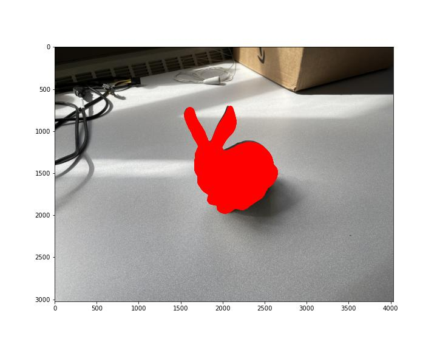  | 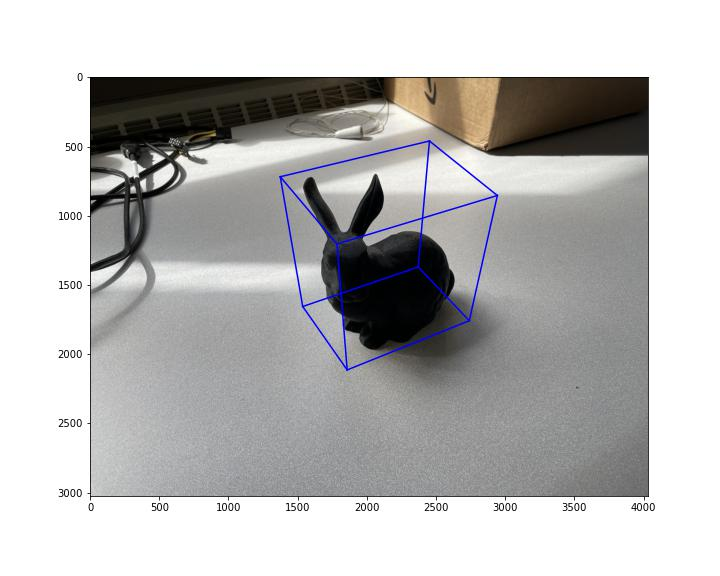 |

### (b) Cuboid (15 points)
**Instructions**
  1. Find (or capture) 1 image of a cuboid. Come up with a 3D coordinate system (by measuring relative dimensions of the cuboid) and annotate 6 pairs of point correspondences.
  2. Compute the camera matrix `P` using your annotated 2D-3D correspondences.
  3. Draw the edges of the cuboid using your calculated `P` or do something fun!

| Input Image  | Annotated 2D points | Result |
| ----------- | ----------- | ----------- |
|  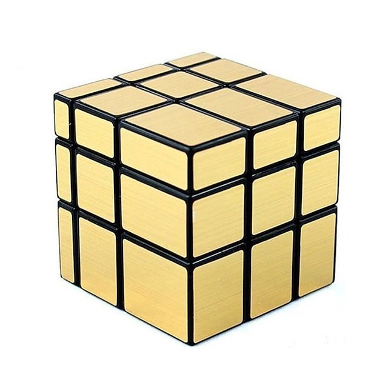  | 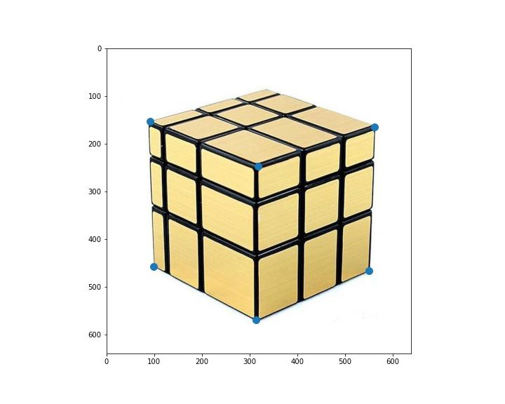 | 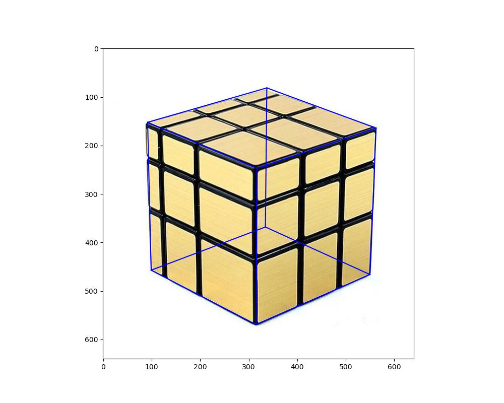 |

## Q2: Camera calibration `K` from annotations (40 points + 10 points bonus)
### (a) Camera calibration from vanishing points (20 points)
In this question, your goal is to compute `K` from a triad of orthogonal vanishing points, assuming that the camera has zero skew, and that the pixels are square. 

**Dataset**

  1. Run your code on `data/q2a.png`. Annotate 3 pairs of parallel lines that are orthogonal to each other.

**Submission**
  1. Output plots of the vanishing points and the principal point. Also include visualizations of the annotations that you used. See the following figures:

  | Input Image  | Annotated Parallel Lines | Vanishing points and principal point |
  | ----------- | ----------- | ----------- |
  |    | 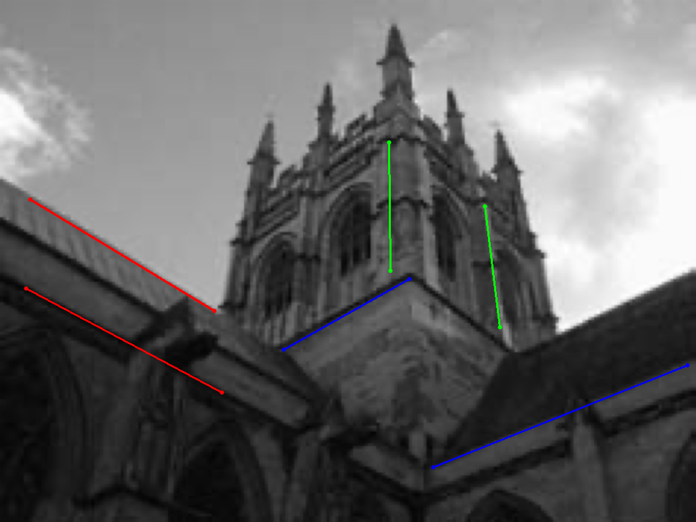 | 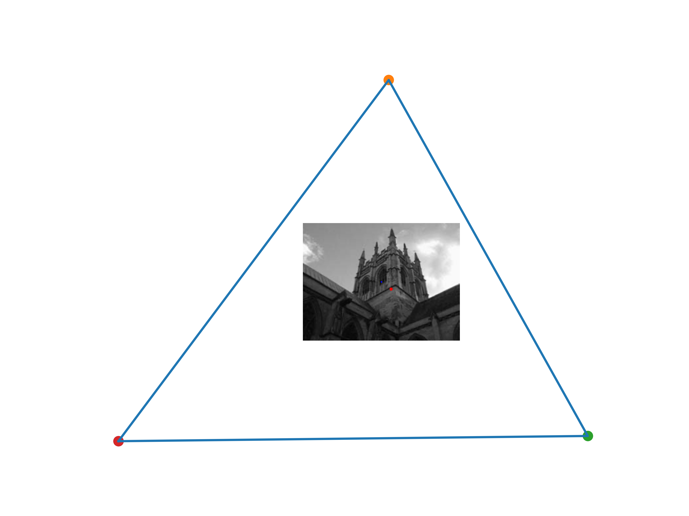 |

  2. Report `K` for the input image.

     [1154.17801827  0.     575.06600499]

     [ -0.     1154.17801827 431.93909042]

     [-0. 0. 1.]

  3. Brief description of your implementation (i.e., the algorithm followed with relevant equations).

     1. In the case of square pixels ω has the form 
        $$
        w =\begin{bmatrix}w_1 & 0 & w_2\\
        0&  w_1 &w_3\\
        w_2 & w_3 & w_4
        \end{bmatrix}
        $$

     2. Each pair of vanishing points vi, vj generates an equation vTi ωvj = 0, which is linear in the elements of ω. The constraints from the three pairs of vanishing points are stacked together to form an equation Aw = 0, where A is a 3 × 4 matrix.
     3. The vector w is obtained as the null vector of A, and this determines ω. The ma- trix K is obtained from ω = (KK^T)−1 by Cholesky factorization of ω, followed by inversion.

  4. 

### (b) Camera calibration from metric planes  (20 points)
In this question, your goal is to compute `K` from image of three squares. Different from (a), you will not make any additional assumption on `K` (except that it is a projective camera). 

**Dataset**

  1. Run your code on `data/q2b.png`. Annotate 3 squares in the image.

**Submission**
  1. Visualizations of annotations that you used. 

     I used provided annotations:

     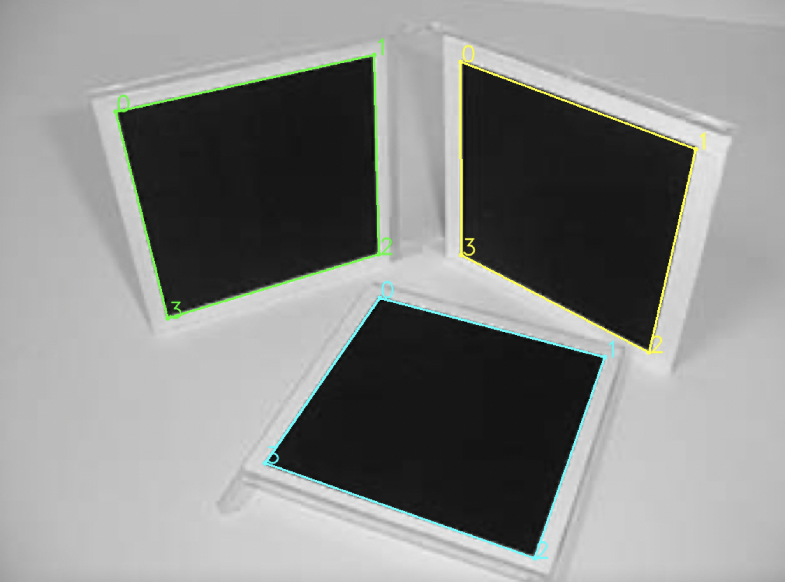

|      |      |      |      |
| ----------- | ----------- | ----------- |  ----------- |
|      |      |      |      |

  2. Evaluate angles between each pair of planes. This will reflect the correctness of your calibration result.

|       | Angle between planes(degree) |
| ----------- | ----------- |
| Plane 1 & Plane 2    | 67.57512 |
| Plane 1 & Plane 3    | 92.24721 |
| Plane 2 & Plane 3    | 94.78379 |

  3. Report `K` for the input image.

     K is:

     [1084.4764, -13.5121, 520.0139]

     [0, 1079.3542,  402.5434] 

     [0.  0.  1.]

  4. Brief description of your implementation (i.e., the algorithm followed with relevant equations).

     Taken from Hartley & Zisserman:

     1. For each square compute the homography H that maps its corner points, (0, 0)T, (1, 0)T, (0, 1)T, (1, 1)T, to their imaged points.

     2. Compute the imaged circular points for the plane of that square as H(1, ±i, 0)T. Writing H = [h1, h2, h3], the imaged circular points are h1 ± ih2.

     3. Fit a conic ω to the six imaged circular points. The constraint that the imaged circular points lie on ω may be rewritten as two real constraints. If h1 ± ih2 lies on ω then (h1 ± ih2)T ω (h1 ± ih2) = 0, and the imaginary and real parts give respectively:

        hT1 ωh2 = 0 and hT1 ωh1 = hT2 ωh2

        which are equations linear in ω. The conic ω is determined up to scale from five or more such equations.

     4. Compute the calibration K from ω = (KKT)−1 using the Cholesky factorization.

## Q3: Single View Reconstruction (30 points + 10 points bonus)
In this question, your goal is to reconstruct a colored point cloud from a single image.

### (a) (30 points)
**Submissions**

  1. Output reconstruction from at least two different views. Also include visualizations of annotations that you used. See the following figure as an example:

| Input Image  | Annotations | Reconstruction View 1 | Reconstruction View 2 | Reconstruction View 3 |
| ----------- | ----------- | ----------- |  ----------- | ----------- |
|    | 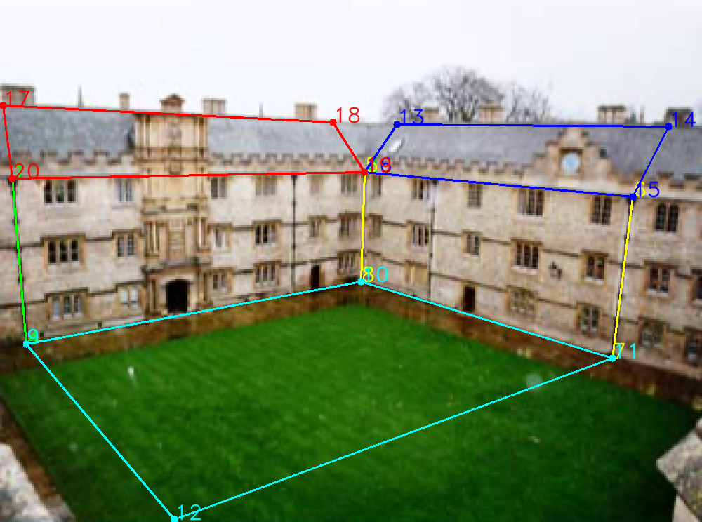 | 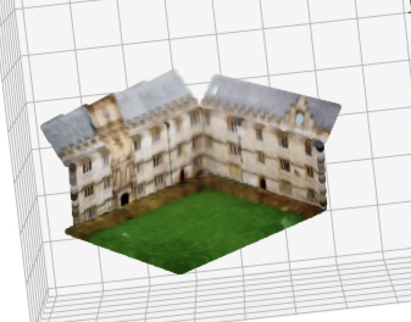 | 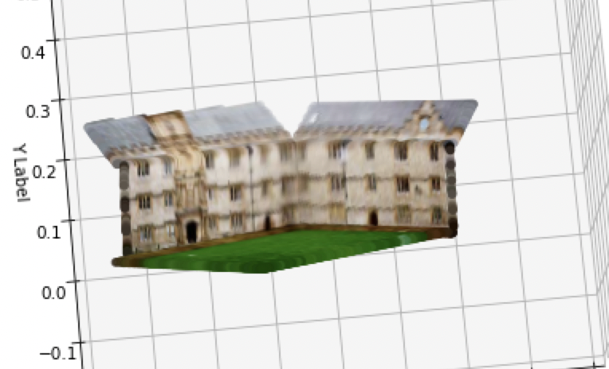 | 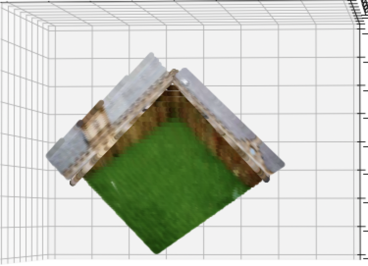 |

    2. Brief description of your implementation (i.e., the algorithm followed with relevant equations).
       1. Use 3 vanishing points to compute K
       2. Choose one reference point, here I used point #1
       3. In camera coordinate, unproject reference point in the image X=K^-1x, and set its depth (scale) in 3D
       4. Compute the plane's normal vector and find a = -n^TX_r
       5. Get rest of the image coordinates in the plane, unproject them to 3D using K
       6. Compute scale for each point such that those points are in the same plane
       7. Repeat the above steps and obtain the equations for all planes

**Hints**

1. For visualization, consider using [3D scatter plot](https://matplotlib.org/stable/gallery/mplot3d/scatter3d.html) from `matplotlib`.

2. Consider following these steps for your implementation:
    1. Use Q2a to compute `K`.
    
    2. Annotate plane boundaries with corner points.
    
    3. Compute plane normals.
    
    4. Compute rays for each point. Pick one point as reference and set its depth. 
    
    5. Compute plane equation given the known 3D point.
    
    6. Compute 3D coordinate of all points on the plane via ray-plane intersection.
    
    7. Repeat the above two steps to obtain equations for all planes (and all 3D points).

