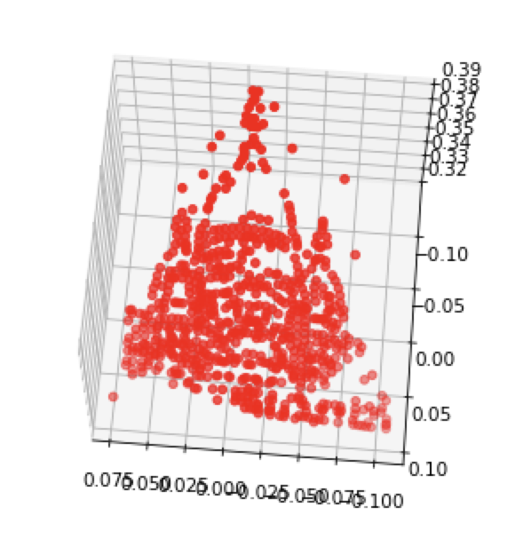
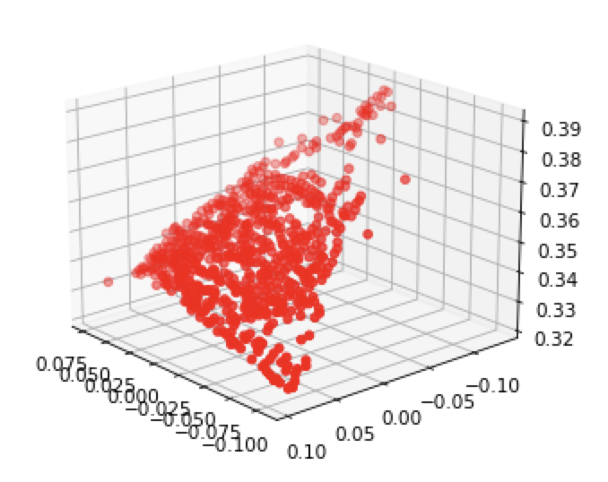
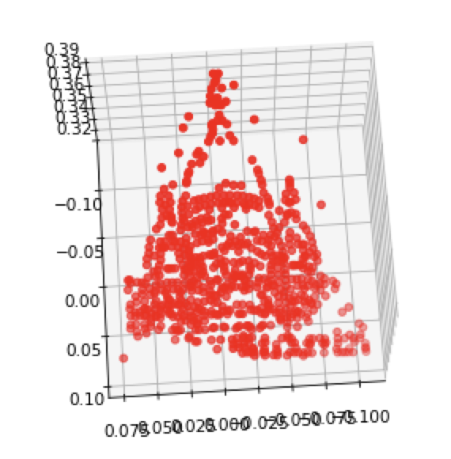
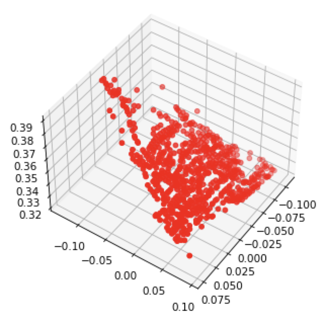
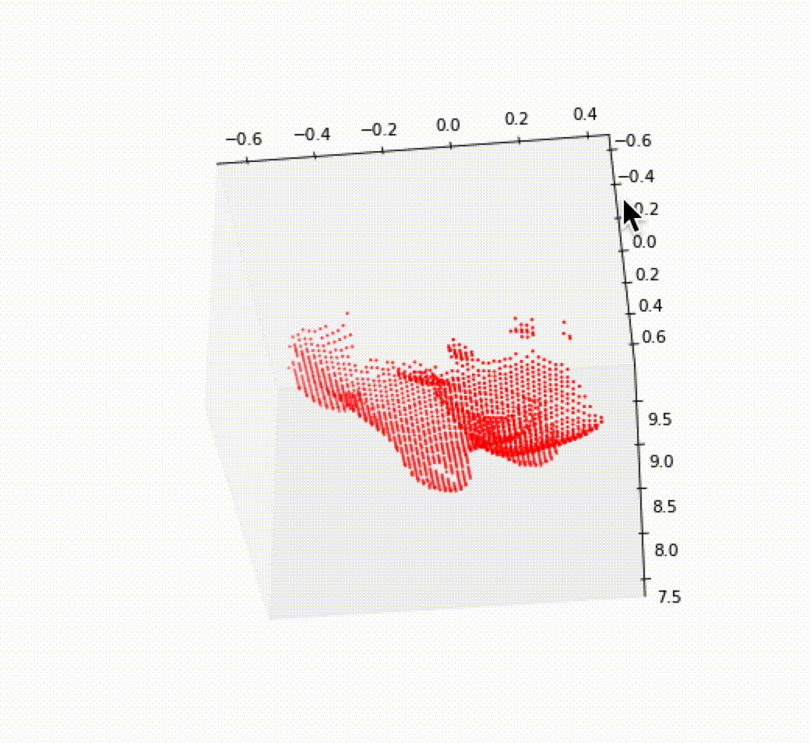
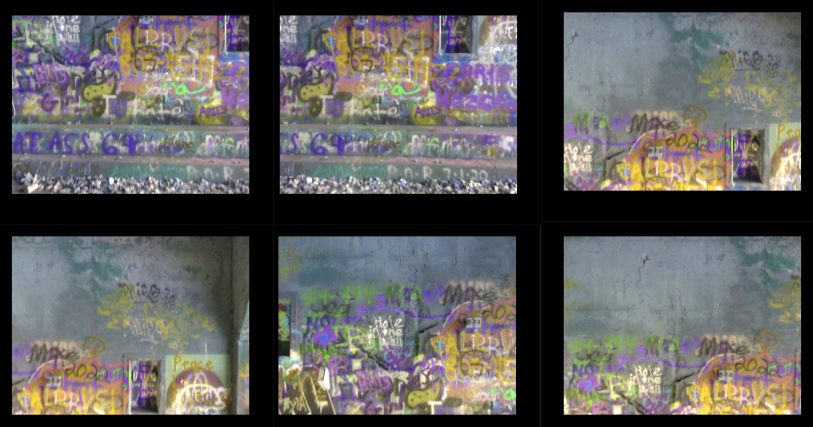
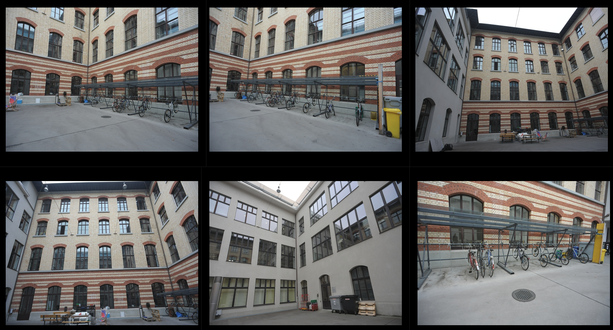
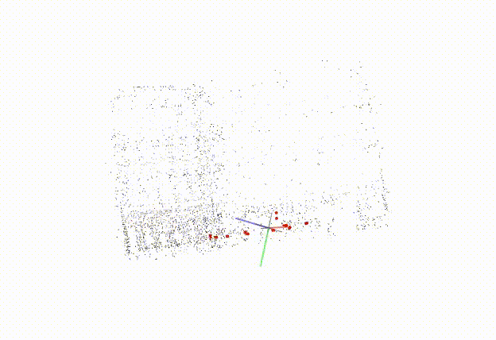
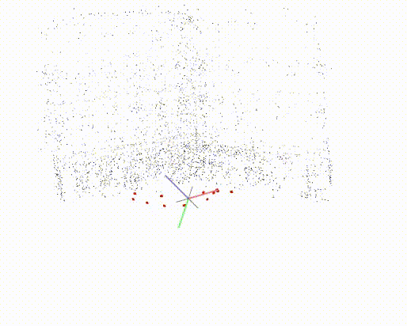

# HW4: Structure from Motion

## Overview

You will implement an entire incremental Structure-from-Motion (SfM) pipeline in this assignment. You will start by implementing an initialization technique for your incremental SfM. Next, given known intrinsics and extrinsics you will implement the incremental SfM over the given 4 images. Finally, utilizing the off-the-shelf tools such as COLMAP on your own sequences and generate the reconstructions.

## Q1: Baseline Reconstruction (20 points)
Your goal in this question is to implement initialization for incremental SfM, i.e., reconstruction on two views. 

**Dataset**

- Run your code on the two "real world" images in `data/monument` folder, which also contains "noisy" keypoint matches.

**Submission**

- Visualization of the 3D reconstruction from at least two views. 

    | View #1 | View #2 | View #3 | View #4 |
    | -----------  | ----------| -----------  | -----------  |
    |    | < |  |  |
    
- Report the extrinsics `R` and `t` of view 2 (which corresponds to `data/monument/img2.jpg`.

    I assumed $R_1$ = eye(3) and $t_1 = zeros(3,1)$ and got the following $R_2$ and $t_2$

    
    $$
    R_2 = 
    \begin{pmatrix}
    0.99932526& -0.02340577& 0.0283055\\
    0.03666105&  0.68255337& -0.72991566\\
    0.00223578& -0.73046086& -0.6829509
    \end{pmatrix}
    \;\;\;\;\;
    t_2 = 
    \begin{pmatrix}
    0.04157028\\
    0.24213574\\
    0.96935143
    \end{pmatrix}
    $$
    
- Brief description of your implementation (i.e., the algorithm followed with relevant equations).

    - compute fundamental matrix using RANSAC and 8 point algorithm, and filter out outliers
    - get essentail matrix by $E = K'^TFK$
    - get pose by decomposing essential matrix, there should be 4 solutions
    - find the correct pose and 3D points by triangulation and reprojection error

## Q2: Incremental Structure-from-Motion (40 points)

Here, you will implement incremental Structure-from-Motion (SfM). You will implement incremental SfM using four synthetic images. We provide "clean" 2D keypoint correspondences across all pairs of these images in the folder `data/data_cow/correspondences/`. Starting from 2 images (whose extrinsincs are provided) and assuming that the intrinsics remain fixed for all the four images, you will incrementally add each of the other 2 images. 

**Dataset**
> Images: `data/data_cow/images`
> Correspondences (all pairs): `data/data_cow/correspondences`
> Cameras: `data/data_cow/cameras`

- Run your code on the four images of synthetic cow in `data/data_cow` folder, which also contains all pair correspondences between 4 images. Please start (initialize) your incremental SfM using `Camera 1` and `Camera 2`. You can assume fixed intrinsics for all the 4 images.

**Submission**

- After each addition of images, your 3D reconstruction from incremental SfM should look something like as shown below. You need to submit your visualization of the 3D reconstructions at each of the following stages. 

    |Using Camera #1 and #2 | After adding Camera #3  | After adding Camera #4 |
    | -----------  | ----------| ---------- |
    |  |  |  |

- Report the extrinsics `R` and `t` of Camera #3 and Camera #4. 

    The camera was initialized at $R_1=eye(3)$ and $t_1=zeros(3,1)$
    $$
    R_3 = \begin{pmatrix}
    0.97792558& -0.00365965& 0.20892145\\
    0.01388832&  0.99877404& -0.04751344\\
    -0.20849144&  0.04936618&  0.97677751
    \end{pmatrix}
    \;\;\;\;
    t_3 = \begin{pmatrix}
    -1.76905818\\
    0.41295848\\
    -0.13300959
    \end{pmatrix}
    $$

    $$
    R_4 = \begin{pmatrix}
    0.96274356& -0.0148443 &  0.2700082\\
    0.0306862 &  0.99803965& -0.0545455\\
    -0.26866929&  0.06079889&  0.96131176
    \end{pmatrix}
    \;\;\;\;
    t_4 = \begin{pmatrix}
    -2.29559185\\
    0.48858473\\
    0.39237407
    \end{pmatrix}
    $$

    

- Brief description of your implementation.

    - Initialization:
        - use two images as baseline to compute initial 3D points and pose
        - filter out outliners

    - new image registration
        - find existing 3D points using project map
        - solve PnP to find new camera pose
        - register new 3D points to existing base

## Q3: Reconstruct your own scene! (40 points)
For this part, you will run an off-the-shelf incremental SfM toolbox such as [COLMAP](https://github.com/colmap/pycolmap) on your own captured multi-view images. Please submit a gif of the reconstructed 3d structure and the location of cameras.

### (A) Generate reconstructions (20 points)
For this reconstruction, you can choose your own data. This data could either be a sequence having rigid objects, any object (for e.g. a mug or a vase in your vicinity), or any scene you wish to reconstruct in 3D.

**Submissions**
-  Scene: graffiti

   -  inputs and dense reconstruction

   | Example Multi-view images  | Output |
   | ----------- | ----------- |
   |    |  |

   - Dense reconstruction

     

-  Scene: ETH3D courtyard

   -  Inputs and sparse reconstruction

      | Example Multi-view images                        | Output               |
      | ------------------------------------------------ | -------------------- |
      |  |  |

   -  Dense reconstruction

      

      

### (B) Stress test the hyperparameters of COLMAP (20 points)
For this part, we want you to `stress test` or play with hyper-parameters in the COLMAP system. We want you to pick `2` interesting questions concerning this toolbox and for each of the question, we want you to provide a brief explanation with supporting qualitative or quantitative evidence. Some example question suggestions are:

- What happens if we reduce number of input images?

  For scene ETH3D courtyard, we tried reduce image **from 27 to 12**, the dense and sparse reconstruction results are as follows:

  | Sparse               | Dense               |
  | -------------------- | ------------------- |
  |  |  |

  The conclusion is that if the images are selected wisely, we can have similar results for sparsely and densely sampled images.

  However, this benefit has a limit, as we kept reducing images, COLMAP ends up with reconstruction failure because no good initial pairs found.

  Specifically, COLMAP requires **three** repeated images for same scene as mentioned in its document.

  

- Under what scenario and conditions does the reconstruction pipeline breaks?

  - the scene has poor feature

  - not enough overlap scenes

    

- Speed up reconstruction by pre-defining camera intrinsics and extrinsics

  - how? for scene1, we actually sampled the scene on a UAV that has odometry reading for each image, and also camera calibration parameters

  - use [this script](https://github.com/colmap/colmap/blob/dev/scripts/python/database.py) provided by colmap to pre-define camera pose in colmap database

  - Results

    |                   | Without pose (sec) | with pose (sec) |
    | ----------------- | ------------------ | --------------- |
    | Time(sec)         | 351                | 136             |
    | Mean distance (m) | 0.00972            | 0.0173          |
    | std               | 0.0125             | 0.0157          |

    *we computed mean distance and std using dense reconstructed PCD with ground truth scans of the tunnel.*

